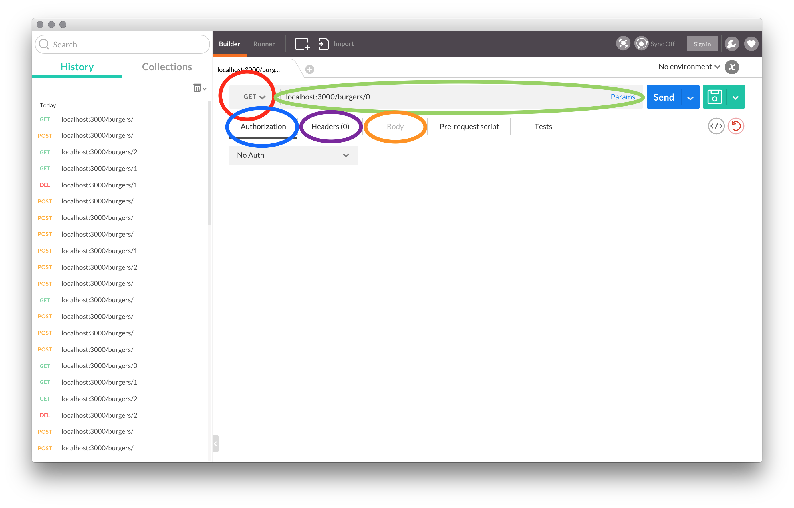
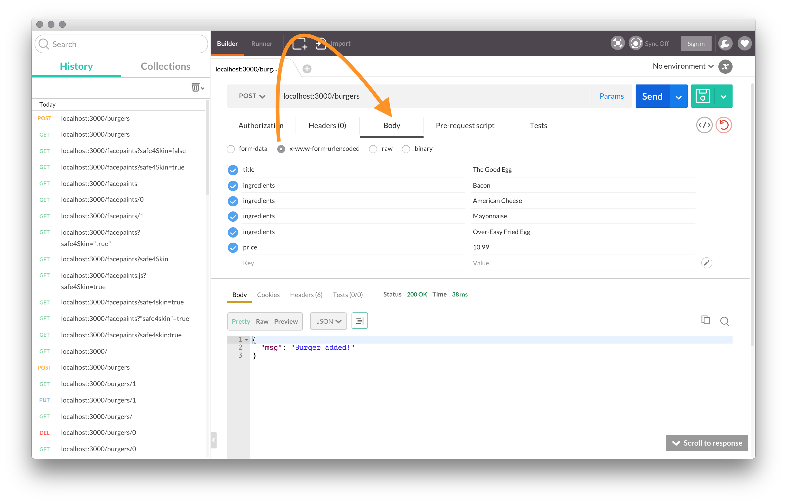

# Cheeseburgers in Cyberspace

## Producing APIs with Node and Express

| Lesson Objectives: SWBAT                 |
| ---------------------------------------- |
| Define a RESTful JSON web service (an "API") |
| Produce a RESTful HTTP JSON web service (an "API”) with Express |
| Use Postman to send data to communicate with a web API |

##### <u>Road Map</u>

1. Serve's Up
2. What is an API?
3. Serving Up Data - GET Requests/Responses
4. Create Data - POST
5. Update Data - PUT
6. Delete Data - DELETE
7. Serve On, Parrothead

## Serve's Up!


Jimmy Buffett didn't stop when he conquered our ears with Margaritaville and Cheesburgers in Paradise. No, he moved on to our stomachs with island escapism themed restaurants. Now, he has his sites [sic] set on our minds by implanting cheeseburgers into cyberspace.

Welcome to your first job out of GA - flipping burgers in cyberspace.

You'll be doing so by creating a Burgers in Cyberspace API with NodeJS and ExpressJS.

## What's an API?

Before we talk about APIs, __take 2 minutes__ to try and find out on your own

> What did you get?!

I bet you found a bunch of stuff that made little or no sense to you.
That's because "API" is a term that exist throughout computing with many different forms.

API stands for *Application Program Interface*.

> "An **API** (application program interface) is a set of routines, protocols, and tools for building software applications. The **API** specifies how software components should interact…"
>
> — [Webopedia](http://www.webopedia.com/TERM/A/API.html)

That may seem like a dense definition, but all it needs is a little unpacking.

**Application Programming Interfaces essentially define how you can use (interact with) any program or object on a computer.** It's the routes to make the technology act.
You've already used many APIs, you just didn't know it. For instance, the `Array` object's API in JavaScript gives us access to methods like `Array.prototype.slice()` or `Array.length`.  

The API we'll be making is a RESTful Web API - it will serve data as JSON about the different hamburgers available at Jimmy Buffett's Cheeseburgers in Cyberspace.

## Serving Up Data - GET

`subl starter_code/` after copying it out of `instructor/`.

We'll be using Postman for the majority of this lesson - let's get acquainted!

#### Postman



**RED** - Set HTTP Verb - POST GET PUT/PATCH DELETE.

**GREEN** - Parameters - set the url for the action

**BLUE** - If any kind of Authorization is necessary, such as OAuth.

**PURPLE** - Set your headers - such as if you want to accept raw JSON.

**ORANGE** - Set the data payload in the body - this is where you can send data to the server.

Postman does a lot more than this, but this is where we'll predominately work during this class.

__Remember__: Postman will save you time - ALWAYS check your routes with Postman.

#### Welcome to Cheeseburgers in Cyberspace

Before we get into routing our own API, go ahead and take **5 minutes** to read over the `starter_code/`.  Focus on `data/`, `config/`, and `controllers/`.

Let's go into `controllers/welcome.js` and see what's happening.

```javascript
module.exports = {
  index: index
};

function index(req, res, next) {
  res.json({msg: "You have found Cheeseburgers in Cyberspace... a new kind of island paradise!"});
};
```

We're creating a function called `index()` that loads the [response object](http://expressjs.com/en/api.html#res) with JSON and delivers it.

We then export the function for use in other files.

Let's see what's using that function in `config/routes.js`

```javascript
var express = require('express'),
    router  = new express.Router();

// Require controllers.
var welcomeController = require('../controllers/welcome');

// root path:
router.get('/', welcomeController.index);

module.exports = router;
```

You learned about the express router yesterday - here we're setting a GET path for our root address and we're attaching that to the `index` function used in the `welcomeController`. We then export the router object to use in our server.

```javascript
// server.js
// Load local libraries.
var routes   = require('./config/routes');

// ...
// Defines all of our "dynamic" routes.
app.use('/', routes);
```

Everyone should `npm install` and `nodemon` in terminal and see what happens when we call to our route path in Postman.

#### Creating our Own Burger Resource: Index and Show

We begin by creating `controllers/burgers.js` - this will give us a place to create the functions we need to serve up data in our API.

In this file, we'll need to require our burger data and set up our exports:

```javascript
var burgers = require('../data/burger_data');

module.exports = {};
```

__Note!__ _We will never again use an object as our data storage. Today we're using the server environment as our "database" because we haven't learned MongoDB, yet. Restarting the server will return the data to the original burgers object._

Now that we have access to our burgers, we need to create an index route. Recall that an index route retrieves ALL of a resource. Therefore, we want to make a JSON response of all our burger data.

We'll also create "error-handling" in our routes, though what we have here is absolutely limited and you'd never (hopefully at least) see it in production code.

```javascript
function index(req, res, next) {
  if (burgers) {
    res.json(burgers);
  } else {
    res.json({err: "Where did all the burgers go?!?"});
  }
};
```

Notice that this method is only serving JSON data and nothing more. This removed the need to render a view - in the future, we will handle the data ourselves in the front end!

Now that we've created this method, we must include it in our `module.exports` object.

```javascript
var burgers = require('../data/burger_data');

module.exports = {
  index: index
};
```

Now that we've exported our function, we'll need to use it in our routes.

In `config/routes.js`, we need to:

- Require our burgers controller
- Make a path for the burgers index using `router.get()`
- Attach the index method on the burgers controller to `/burgers`

```javascript
var express = require('express'),
    router  = new express.Router();

// Require controllers.
var welcomeController = require('../controllers/welcome');
var burgersController = require('../controllers/burgers');

// root path:
router.get('/', welcomeController.index);

// burgers resource paths:
router.get('/burgers', burgersController.index);

module.exports = router;
```

Notice that we name the route within the get method on the router object in the first argument, and attach our index function in the second argument.

Now we should be able to see an index of our burgers at `localhost:3000/burgers`.

##### Take Note!

Even though we can set up our routes in any way we choose, we're going to set up our website with a RESTful architecture. This has as much to do with convention as keeping your code clean and easily understood.

#### Burger Show Route

We now need to find a way to access a singular burger in our site. We'll set this up restfully and access them by an id. This time, lets start in the routes:

```javascript
// burgers resource paths:
router.get('/burgers',     burgersController.index);
router.get('/burgers/:id', burgersController.show);
```

Much like Rails, we'll be using a placeholder in our params object called `:id`. Notice, that unlike Rails, we name it ourselves! This means we must be careful in our namespacing if we're creating a nested resource.

In our controller, we'll need to grab the id from the params object - not too different from Rails, right?

We'll then find that burger in our array and respond with that object in JSON.

```javascript
var burgers = require('../data/burger_data');

module.exports = {
  index: index,
  show:  show
};

// …
// burger show page
function show(req, res, next) {
  // grab the id from the params in the request object
  // You'll need to convert it to a number since it will come in as a string
  var id = parseInt(req.params.id);
  // find the chosen burger using es6' Array.prototype.find() method
  var chosenBurger = burgers.find(function(burger) {
    return burger.id === id;
  })
  // If found, respond with the resource as JSON
  // otherwise send an error
  if (chosenBurger) {
    res.json(chosenBurger);
  } else {
    res.json({err: "That burger must have escaped this island!"})
  }
};
```

We now have routes to show our burgers based on their ids!

## Create Data - POST


As with all CRUD apps, we will be using the POST method next.

Let's start in the routes again.

So far, we've only seen the router's get method - now we're going to use the post method:

```javascript
// burgers resource paths:
router.get('/burgers',     burgersController.index);
router.get('/burgers/:id', burgersController.show);
router.post('/burgers',    burgersController.create);
```

Now we have a route to post new burgers, but we still need the attached method to serve our data.

In the burger controller, we'll need to create a create function.

Things to keep in mind:

1. We need to take the new burger from the body on the response object.
2. We'll need to use the id attribute of our `burgers` array to keep track of how many we've made.
3. We need to push the new burger into our burgers array.
4. We need to confirm the create method worked
5. Include the method in our exports

In `controllers/burgers.js`

```javascript
var burgers = require('../data/burger_data');

// #5
module.exports = {
  index:  index,
  show:   show,
  create: create
};

// Burger Methods
// …

function create(req, res, next) {
  // #1
  var burger   = req.body;
  var preCount = burgers.length;
  // #2
  burger.id    = burgers.id;
  burgers.id++; // Always prepare the id for the next burger post
  // #3
  burgers.push(burger);
  // #4
  if (burgers.length > preCount) {
    res.json({msg: "Burger added!"});
  } else {
    res.json({err: "Ya burned the bacon!!"});
  }
}
```

We can now post burgers by using Postman's body feature:

1. Select the method POST
2. Choose x-www-form-urlencoded in the Body section
3. Set the key value pairs



## Update Data - PUT

Our next route will update our burgers. Again, lets start in `config/routes.js`.

We'll be using the PUT method on our router object:

```javascript
// burgers resource paths:
router.get('/burgers',     burgersController.index);
router.get('/burgers/:id', burgersController.show);
router.post('/burgers',    burgersController.create);
router.put('/burgers/:id', burgersController.update);
```

Now with our update function, we'll need to keep some things in mind:

1. Grab the burger out of the request's body
2. Grab the id from the params object
3. Find the burger that needs to be updated
4. Update that burger only if the specific field has changed.
5. Include the method in our exports

```javascript
var burgers = require('../data/burger_data');

// #5
module.exports = {
  index:  index,
  show:   show,
  create: create,
  update: update
};

// Burger Methods
// …

function update(req, res, next) {
  // #1
  var updateBurger = req.body;
  // #2
  var id = parseInt(req.params.id);
  // #3
  var burger = burgers.find(function(burger) {
    return burger.id === id;
  });
  // #4
  if (updateBurger !== burger) {
    if (updateBurger.title)       burger.title       = updateBurger.title;
    if (updateBurger.ingredients) burger.ingredients = updateBurger.ingredients;
    if (updateBurger.price)       burger.price       = updateBurger.price;
    res.json({msg: "Burger updated!"})
  } else if (updateBurger === burger) {
    res.json({msg: "That burger is perfect the way it is!"})
  } else {
    res.json({err: "That burger doesn't exist!"})
  }
}
```

Congrats! We have an update function. Let's test it in Postman.

## Destroy Data - DELETE

We've come to our final method - delete!

You can probably expect the router method. Remember that it will need an id placeholder in the params!

```javascript
// burgers resource paths:
router.get('/burgers',        burgersController.index);
router.get('/burgers/:id',    burgersController.show);
router.post('/burgers',       burgersController.create);
router.put('/burgers/:id',    burgersController.update);
router.delete('/burgers/:id', burgersController.destroy);
```

Now to our controller. To create a destroy method:

1. Grab the id from the params object - make sure to `parseInt`
2. Find the chosen burger
3. Store the id in a variable
4. If there is a corresponding burger, remove it from the burgers array and send out a confirmation message.
5. Add the method to the exports

```javascript
var burgers = require('../data/burger_data');

// #5
module.exports = {
  index:   index,
  show:    show,
  create:  create,
  update:  update,
  destroy: destroy
};

// Burger Methods
// …

function destroy(req, res, next) {
  // #1
  var id           = parseInt(req.params.id);
  // #2
  var chosenBurger = burgers.find(function(burger) {
    return burger.id === id;
  });
  // #3
  var cBurgerId = burgers.indexOf(chosenBurger);
  // #4
  if (chosenBurger) {
    burgers.splice(cBurgerId, 1)
    res.json({msg: "Always sad to see a burger go..."})
  } else {
    res.json({err: "Why are you trying to delete my burgers?"})
  }
}
```

And there you have it - we've created a resource on our very own API! Go ahead and test this delete route in Postman.

## Serve On, Parrothead!

Now as a commander of the Parrothead nation, you've been awarded an official License to Chill. You will control the ears, stomachs, and MINDS of all island-escapists that grew up watching too much Gilligan's Island.

We now know how to create a resource for our very own API. In this lesson, we used dummy data, storing posts in our browser. __We're most likely never going to do that again.__ We'll add a layer of complexity later in the week with MongoDB.  

Let's close on some questions:

1. What is an API?
2. Why kind of data are we sending in our Express API?
3. Where is the input data stored in the POST and PUT methods?

#### References

[Anatomy of an HTTP Transaction](https://nodejs.org/en/docs/guides/anatomy-of-an-http-transaction/)

[Express Response Object](http://expressjs.com/en/api.html#res)

[MDN JSON](https://developer.mozilla.org/en-US/docs/Web/JavaScript/Reference/Global_Objects/JSON)
