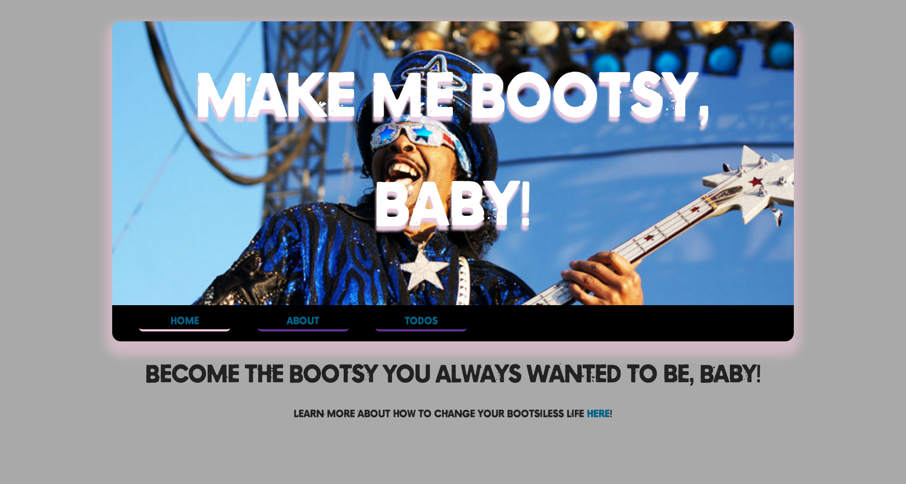
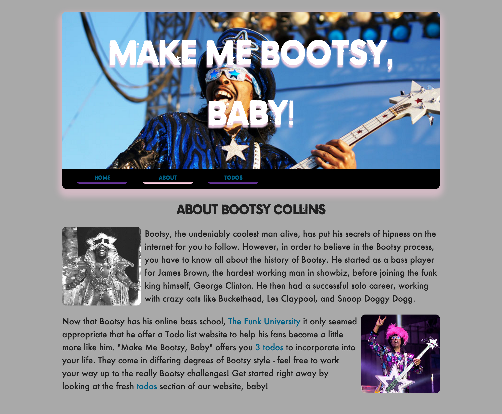
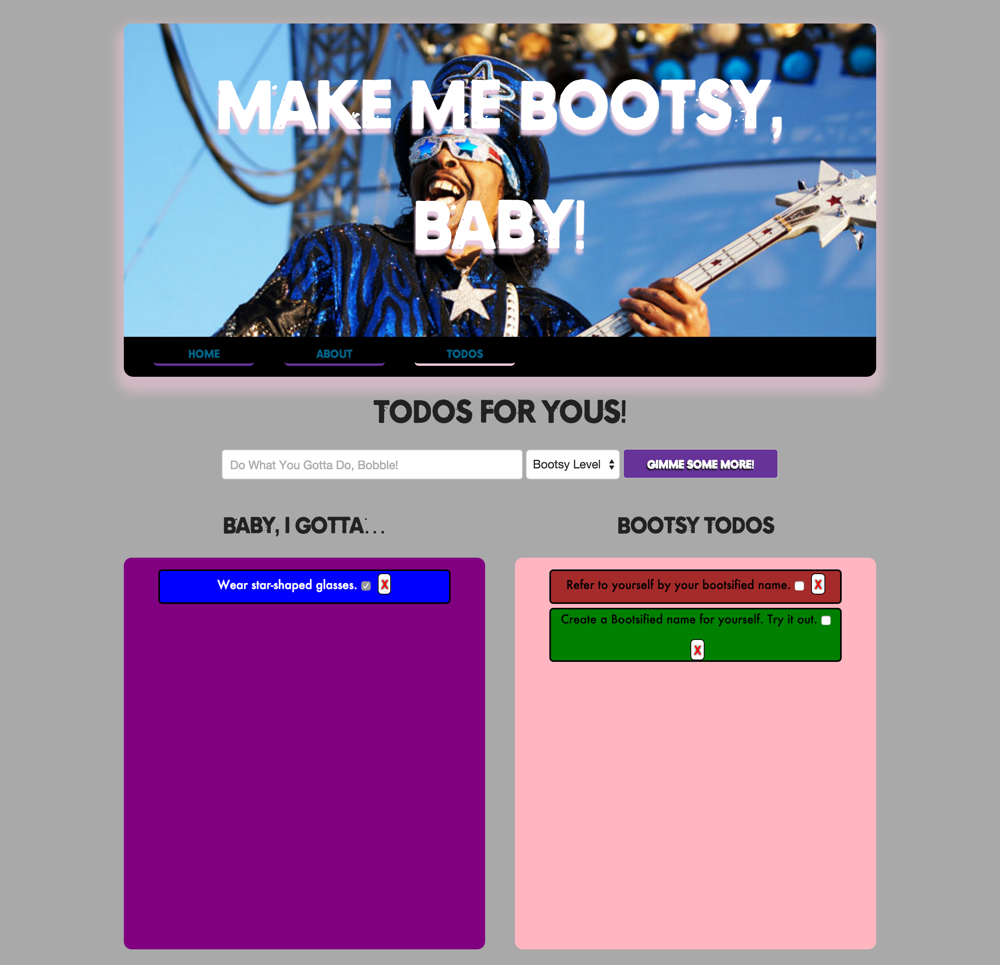

# Make Me Bootsy, Baby!

## Todo App Using LoDash Templates

| Lesson Objectives: SWBAT                 |
| ---------------------------------------- |
| Use the LoDash library to place dynamic parts of HTML |
| Use EJS templates                        |
| Build a full "MEN" stack app             |
| Use AJAX calls within a full stack application |

#### Road Map

1. It's Bootsy, Baby!
2. Pre-planning
3. Server-Side Templates v. Client-Side Templates
4. Things We Gotta Know
5. Let Us Begin!

## It's BOOTSY, Baby!

Today we'll be building a Todo app all about [Bootsy Collins](https://en.wikipedia.org/wiki/Bootsy_Collins), The Man Who Put Bass In Yer Face (back left, seen here in the JBs - James Brown's Band).

As a lousy bass player, I always wondered, how did Bootsy get so dang good at bass?

As a poor dresser, I always wondered, how did Bootsy get so dang good at dressing himself?

As a poor chiller, I alwasy wondered, how did Bootsy chill so dang hard!?

Quickly, I realized I needed an application that would help me become more like Bootsy Collins.

**Could you build me a todo app that could help me lead a more Bootsy lifestyle?**

## Pre-Planning

Let's quickly look at what the final app will resemble.

**Home Page**: No data is being pulled from the DB.

**About Page**: Needs only the amount of todos in the db - should be solved by server-side templating.

**Todos Page**: This page needs a significant amount of data to CRUD our Todo resource. Additionally, if we're planning to handle CRUDing between page-loads, we'll need client-side templates with LoDash.

#### Take 5 minutes to review the code.

Things to note from photos:

- The navbar elements' bottom-border changes when on its corresponding page (**HINT**: Using the custom - written by me - class name `selected`)
- In the todos page, when a Todo's checkbox is checked, it moves to the "Baby, I Gotta…" field.
- Each todo has a bootsy level, from 0-5. The color of the hint corresponds to the level.
  - Bootsy Level 0: No background color, class name `bootsy0`
  - Bootsy Level 1: Blue background, class name `bootsy1`
  - Bootsy Level 2: Green background, class name `bootsy2`
  - Bootsy Level 3: Brown background, class name `bootsy3`
  - Bootsy Level 4: Red background, class name `bootsy4`
  - Bootsy Level 5: Gold background, class name `bootsy5`

## Server-Side Templates v. Client-Side Templates

In this app we use BOTH server-side templates and client-side templates.

**How do you know when you should use one or the other?**

In terms of this app, we've made it pretty simple. However, in the future, it might be hard to tell. Here's a good way to think about it:

- Is the data static or dynamic? By that I mean, do we see a resource changing in front of our eyes, or do we simply see a value that doesn't change on screen?

If your data remains static, you can use server-side templates, as the data will probably not change between page loads.

If the data is constantly changing, you need to use client-side templates to update the database AND update the view BETWEEN page-loads!

## Things We GOTTA Know!

**Listen to the Great Bootsy!**

In order to get started, there's a few things you should know.

1. I changed the ejs delimiter to differentiate it between the LoDash delimiter.
   - EJS: `<$= todo.name $>`
   - LoDash: `<%= todo.name %>`
2. **You shouldn't have to worry about CSS… much.** You most likely won't have to write any CSS. The only classes you'll need to know are:
   - `todo-item` — for each new `<li>` in the todos box
   - `remove-item` — for each delete `` (or you may rewrite it with a button, since it's a little ugly)
   - `bootsy0` - `bootsy5` — to give the li the correct corresponding background color
   - `selected` — to show which page we're on in the navbar
3. You must write your own `seeds.js` and `todo.js` model.

## Let Us Begin, Bobble!

We'll be building this app for the remainder of the day. Here's how I expect we'll start:

1. Set up the basics.
   - Create a todo model
   - Create seeds for that todo
   - Set up our pages controller
   - Set up routes for our pages
2. Complete server side templating for the about page
3. Make the navbar reflect which page we're on
4. Todos Page - Move through this in bite-sized pieces:
   - First, make an API controller for Todos, so you can interact with them using AJAX
   - Require the controller in your routes file
5. Go through each action (create, index, update, destroy) - Let's assume we start with #create:
   - Create the create action on the Todo API controller.
   - Create a POST route for the create action on the API controller.
   - Move to client side - be sure you can access the new todo from the form
   - Then try and post the todo to your database - check in Postman to see if it's persisted
   - Finally, take that new data and prepend/append it to the Bootsy todo column
6. Once you've finished all the actions, you're done!
   - [Deploy your app](https://github.com/ga-students/WDI_DTLA_9/tree/master/work/w07/d04/express-review)!
   - **BONUS**: Use jQueryUI's drag and drop feature, and remove the ugly checkbox!

Today's going to be a busy day, so enjoy your break and then lets get to it.

##### References

[A closer look at Underscore templates](http://www.2ality.com/2012/06/underscore-templates.html)

[Using Underscore.js Templates To Render HTML Partials](http://www.bennadel.com/blog/2411-using-underscore-js-templates-to-render-html-partials.htm)
