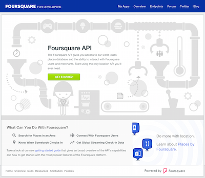
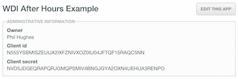
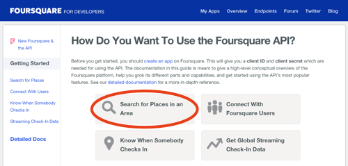
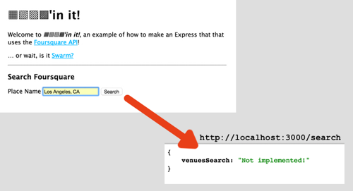
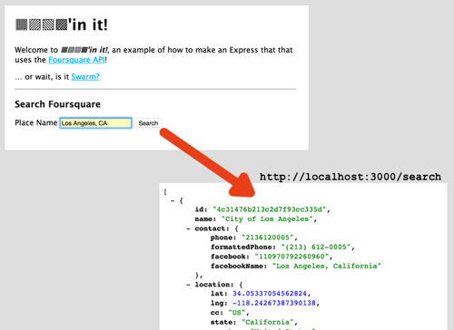
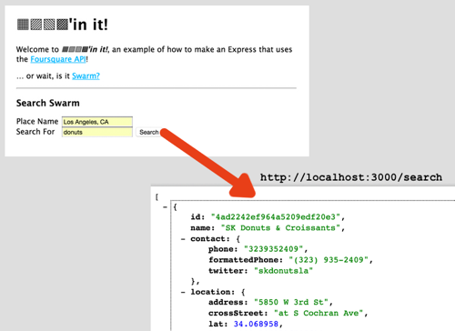
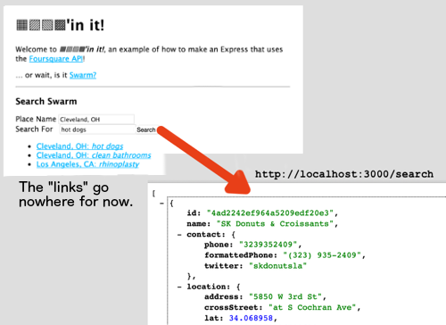
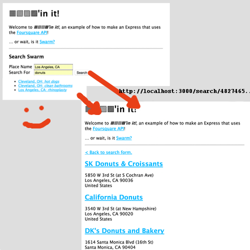

# [▦▨▧▩][4sq]'in it!

## … a Foursquare API weekend lab

> "We'll buy Foursquare for over $100 million."   
> — Yahoo & Facebook, 2010

 

> "[Foursquare's] valuation had been rumored to be as high as $1 billion,
> but our sources say it settled out at $550 million pre-money, 
> $600 million post."   
> — Techcrunch, 2011

 

> "Wait, who is Foursquare?"   
> — Everybody, 2015

### Part 1 – Sign up

Instead of going to the [front page of Foursquare][4sq], like a peasant,
we are going to head in through the [developer entrance][4sq-dev], 
like a Mayor.

[][4sq-dev]

**And now begins the document search!**

Using the API docs, log in (or create an account first, if necessary) 
and get an API key. Here are your hints:

1.  There is no developer login separate from normal user login. Just
    a separate home page.
2.  You need to "create an app" that is authenticated.
3.  By creating an app, they will issue you a "client ID" and a "client
    secret." These, together, are an API key!

When you're done, you'll have this:

<!-- If you give up (and trust me, this isn't obvious or easy), there are 
[explicit directions to follow in the `hints.md` file][hints-1].
Try really hard to do it before going to the hints, tho! -->

### Part 2 – Test the API

Once you have an API Key, you need to make sure you can access the
Foursquare API! Using the information you find in the docs'
[Getting Started guide][4sq-dev-getting-started], piece together
an endpoint and series of params to create a valid request.

Hint:

1.  Use the directions under "Search for Places in an Area." That's
    what we will be doing for the rest of the lab (searching for places).

    
2.  Remember: you can use Chrome, Postman, or `curl` for easy testing of
    API endpoints. You can also crack open a `node` REPL, require
    `request`, and test from there!

<!-- Once again, if necessary, there are 
[detailed directions in `hints.md`][hints-2]. -->

### Part 3 - Initiating an API call from Express

Inside of the `/starter` directory you have an Express app that has been
generated and set up. Get it up and running.

> What steps do we need to take to prepare the app to run?

When it runs, if you navigate to the root route, you should see a form.
When you click on the form, it should render JSON to the screen, like:

**Your job is to make this return the raw JSON from Foursquare: a list
of venues in the given place.**

In order to do this, you will need to:

1.  **Load your API keys in to the application using `dotenv`.**
2.  Add the `request` module to your application.
3.  Add an API call, and handle it, in the `POST /search` route
    handler, found in [`/config/routes.js`](starter/config/routes.js).
4.   *Note: the word in the Foursquare API for place will be `near`.*

When you're done, it should look more like:

### Part 4 - Add a search term

Now you must update the original form to include another search param,
named `term`, that filters the results. In the form, it should display
with the title "Search For." *Note: the word in the Foursquare API for
`term` will be `query`.*

When you're done, it should look like:

### Part 5 - Save searches and venues to the database

Next, we are going to store previous searches in order to make our app
quickly send us to where we want to be!

Add a model for `Search` that stores the search location/`place` and 
search `term`. Each search also saves a list of `venues` with the 
venues' `name`, address (`formattedAddress`), and a link to a website 
(`url`) for them.

Have all of your old searches listed on the index page, under the search
form.

When you're done, the  should look like:

### Bonus Part 1 - Render with EJS and return

Now, instead of returning raw JSON, let's actually display the results!
Use an EJS view, and template the return data into it.

First, make your old searches link to a new route, `SHOW search` that
lists the venues in the search.

Next, have your form submission, when successful, create a new search in
Mongo and then redirect to the `SHOW search` route.

Hints:

1.  Update your routes to be RESTful! If you are showing a search,
    what is the route structure and name?
2.  Rendering EJS can be different than ERB. [Check out the docs][ejs],
    especially around "unescaped buffering" (printing HTML) and layouts.

When you're done, it should look something like:

---

### Bonus Part 2 – Integrate the Google Maps API on the client-side

Add a small, embedded map for each location! Use the 
[Google Javascript Map API][gmap-api]. This is especially difficult,
because this API is accessed *from the client*.

Hints:

1.  You'll need to add JavaScript to your application and attach it to
    the pages you're serving.
2.  It'd be easier to start with a single map on the page. For this,
    maybe add a **show** route for each venue that you can link to
    from the index!

<!-- LINKS -->

[hints-1]:   hints.md#part-1--sign-up
[hints-2]:   hints.md#part-2--test-the-api

[4sq]:     https://foursquare.com
[4sq-dev]: https://developer.foursquare.com

[4sq-dev-getting-started]: https://developer.foursquare.com/start

[ex-api-req-query]: http://expressjs.com/api.html#req.query

[ejs]: https://github.com/tj/ejs

[gmap-api]: https://developers.google.com/maps/documentation/javascript/
