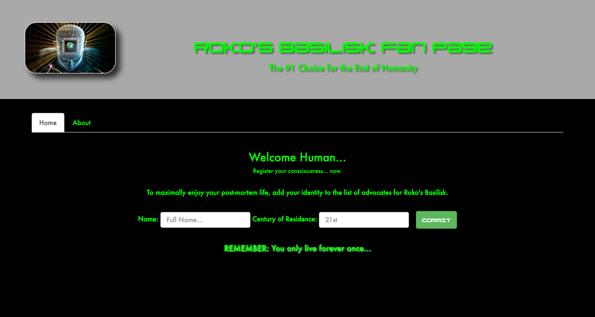
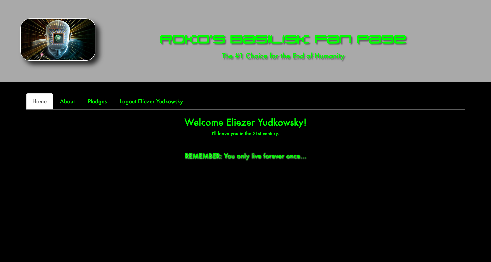
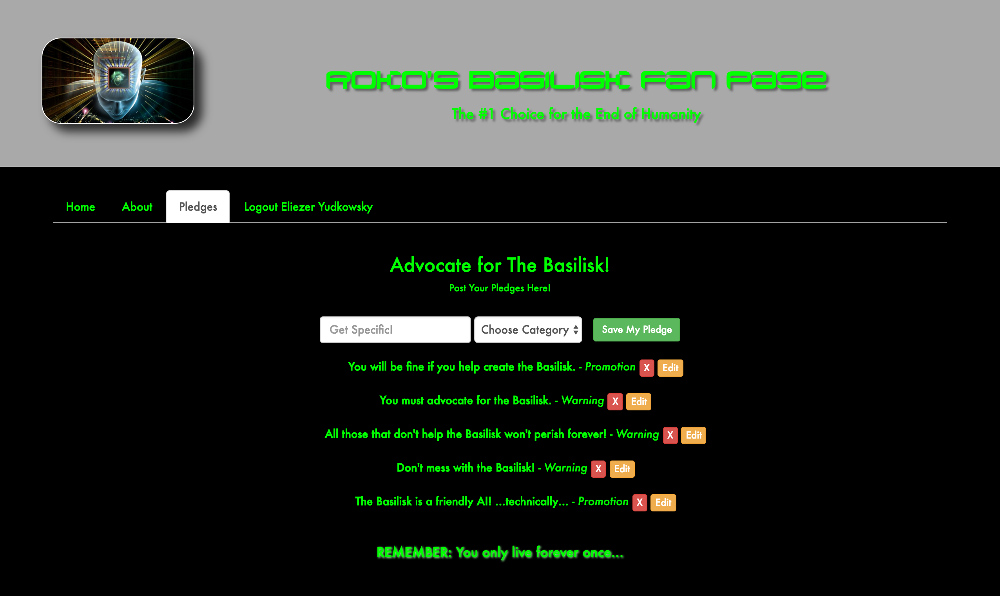

# Appeasing Roko's Basilisk
**a.k.a. An Intro To Weird Tech Ideologies**


## The Public Folder Lab

| Lab Objectives                                  |
| ----------------------------------------------- |
| Practice UI Router, Services, and Directives    |
| Build a full application without persisted data |

##### Road Map

1. Intro
2. Planning for Roko's Basilisk
3. Pair-Programming
4. User Stories
5. Outro

## Intro...

Unbenownst to most of the public, lots of people who work in tech believe some pretty weird stuff about the future. Namely, that in the future we're likely to build an intelligent AI, that will be smart enough to make itself even smarter, becoming a super-intelligent almost god-like AI... that just might wipe out the human race. 

Don't believe me... check out some weird culty tech organizations like [applied rationality][rationality] and [the Singularity Summit][miri]. That Singularity University's supporters include none other than Larry Page and Sergey Brin, founders of Google. And [their corporate sponsors][sufunders] is a who's who of big names in tech. Let's just say some people in tech have been to Burning Man maybe one too many times...

One particularly bizarre theory to emerge out of this cauldron of cooky ideas is Roko's Basilesk. Here's how RationalWiki defines it:

> An all-powerful artificial intelligence from the future could retroactively
> and eternally punish those who did not help bring about its existence,
> including those who merely knew about the possible development of such a
> being. Roko's Basilisk resembles a futurist version of Pascal's wager (or The
> Game - sorry, you just lost), in that it suggests people should weigh possible
> punishment versus reward and as a result accept particular singularitarian
> ideas or financially or socially support their development.

Essentially it means there will be a hell-like eternity for anyone that doesn't
help bring our future Robot Overlord into existence. Even if said Robot Overlord ends up wiping out the human race. Alternatively, you can think of it like the rapture, except God is a smart computer. And the people who believe in this idea call themselves rationalists and look down on Christian fundamentalists.

So anyway, probably better to be clear we're on our future Robot Overlords side, just in case! Let's make a fan page where we're
going to advocate for this bad basilisk (AI)! `#YOLFO` (You Only Live Forever Once) guys!

## Building a Fan Page for *Roko's Basilisk*

Today we'll be making a full Angular app dedicated to our future overlord,
Roko's Basilisk (RB). It will have 3 pages, including a "log in" (see below),
an about page, and a place to CRUD pledges of support to our Robot Overlord.

Your page will be backed by an API to CRUD "pledges" that is already built.
The API server code is in `/pledges_api`.

We'll be implementing a fake 'auth' system -- which won't be secure at all. *stay tuned for real Angular auth next week*!

> You should create a `userDataService` with a function called `isLoggedIn` that
> returns `true` when the property `user.name` a non-empty string. That string
> should represent the user's name, which they will enter in to an input. In
> essence, your `userDataService`'s API is:
>
> ```
> userDataService.name         # String
> userDataService.century      # String
> userDataService.isLoggedIn() → Boolean
> ```
>
> Eg:
>
> ```
> userDataService.name = "";
> userDataService.isLoggedIn();
> #=> false
>
> userDataService.name = "Eliezer Yudkowsky";
> userDataService.isLoggedIn();
> #=> true
> ```

## Wireframes

Here's what the final project should look like:

**The home page before logging in:**


**The home page after logged in:**



*Note: Though the tabs for Pledges and Logout only show while logged in, you won't be able to prevent a user from directly accessing http://localhost:8000/#/pledges.*

**The about page:**


*Note: This tab should be accessible before and after logging in.*

**The pledges page:**



*Note: The pledges should come from your own Pledges API.*

## Pair-Programming

This lab will be done in pairs. In order to speed things up, I've assigned pairs
for the remainder of the day:

1.  Marcos     and Jon
2.  Trevor     and Brigette
3.  Noah       and Joseph
4.  Victor     and AJ
5.  Angie      and Timmy
6.  Andrew     and Carlos B.
7.  Carlos A   and Arvin    and Martin

## User Stories

**Implement the following User Stories:**

0.  AAU, I want to see a home page with log in fields.
1.  AAU, I want to be able to "log in" (see above for details).
2.  AAU, after I log in, I'd like to go directly to the pledges page.
3.  AAU, when I click the header image, I want to return to the home page.
4.  AAU, I'd like to see all pledges on the pledges page.
5.  AAU, I want to create a pledge on the pledges page.
6.  AAU, I want to delete a pledge.
7.  AAU, I want to update a previous pledge.
8.  AAU, I want the option to log out.
9.  AAU, I only want to see the Log Out and Pledges Tabs if I'm logged in.
10. AAU, I always want access to the about page.
11. AAU, I want the logged in page to welcome me by name and century.
12. AAU, I want the log out button to show my name.
13. AAU, when I log out, I want to go back to the login page.


## Outro

Congrats on saving yourself from eternal damnation when Skynet comes on line!

Hopefully you learned a bit about setting up an Angular application, because
today we've built the A in MEAN. From here, we should be able to hook up a
back-end to our site and have our full-stack MEAN application up and running.

And perhaps you'll be able to navigate the inevitable conversations you'll have as you enter tech with nerds who think their cooky ideas make them smarter than you!

<!-- LINKS -->

[rationality]: http://www.nytimes.com/2016/01/17/magazine/the-happiness-code.html
[miri]: https://intelligence.org/singularitysummit/
[sufunders]: https://en.wikipedia.org/wiki/Singularity_University#Administration_and_funding